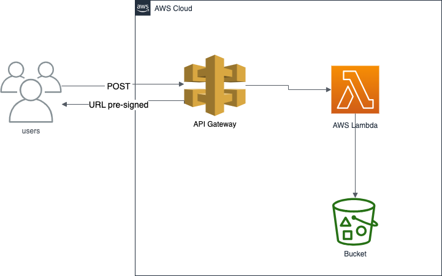

# MVP serverless-app:

This README provides an overview of the Minimum Viable Product (MVP) of a serverless architecture utilizing Amazon Web Services (AWS). The architecture consists of API Gateway for handling HTTP requests, Lambda functions for processing data with Python, and S3 for storing files and generating pre-signed URLs.

# Architecture



# Components:

## API Gateway:

- Acts as the entrypoint for incoming HTTP requests.
- Routes requests to appropriate Lambda functions.
- Provides features like request validation, response transformation, and rate limiting.

## Lambda Functions:

- Written in Python, these functions handle the business logic of the application.
- Receive data from API Gateway, process it, and interact with other AWS services as needed.
- Specifically, one Lambda function will process incoming text data, extract the top 10 most frequent words, and store the result in an S3 bucket.

## S3 (Simple Storage Service):

- Stores the processed data, such as the JSON file containing the top 10 most frequent words.
- Generates pre-signed URLs to allow secure access to the stored files for a limited time period.

# MVP Workflow:

## API Gateway Configuration:

- Set up API Gateway endpoints to receive incoming POST requests.
- Configure request validation and integration with Lambda functions.

## Lambda Function:

- Create a Lambda function written in Python to process incoming text data.
- Utilize libraries like boto3 to interact with S3 for file storage.
- Generate pre-signed URLs for accessing the stored files securely.

## S3 Bucket Configuration:

- Create an S3 bucket to store the processed data.
- Configure bucket policies and permissions to allow access from the Lambda function.

# Deployment Steps:

## Prerequisites:

- AWS account with appropriate permissions.
- AWS CLI installed and configured.
- Terraform installed for managing infrastructure as code (optional but recommended).

## Deploying Infrastructure:

- Clone the repo in local:

```bash
git clone git@github.com:sandraber/serverless-app.git
```

- Use Terraform code in `infra` folder to provision the necessary resources (API Gateway, Lambda function, S3 bucket), changing the backend and the profile AWS in these files:

 `backend.tf`
```terraform

terraform {
  backend "s3" {
    bucket  = "NAME-OF-YOUR-BUCKET"
    key     = "serverles-app/terraform.tfstate"
    region  = "eu-west-1" # YOUR REGION
    profile = "terraform" # YOUR PROFILE IN AWS CLI.
  }
}
```
 `providers.tf`
```terraform
provider "aws" {
  region              = var.region
  profile             = "terraform" # YOUR PROFILE WITH ADMIN PERMISSIONS IN AWS.
  allowed_account_ids = ["xxxxxxxxx"] ## PUT YOUR ACCOUNT ID

  default_tags {
    tags = {
      Role        = var.project_name
      Provisioner = "Terraform"
    }
  }
}
```
 `terraform.tfvars`
```terraform
project_name = "serverless-app"
region       = "eu-west-1" ## YOUR REGION.
```
- Ensure proper configurations for security, permissions, and resource dependencies.

## Testing:

- Test the API endpoints using tools like curl or Postman.

 Example:
```bash
curl -X POST \
  -H "Content-Type: application/json" \
  -d '{ "text": "ma mo ma mo mi me ma mo mi ma ma mo mo me ma mo" }' \
  https://r79ka8n1wl.execute-api.eu-west-1.amazonaws.com/prod/process
```
- Verify that the Lambda function processes data correctly and stores the result in the S3 bucket, name bucket:serverless-app-lambda.
- Test the pre-signed URLs to ensure secure access to the stored files.

# Lambda Function Details:
The Python Lambda function processes incoming text data, extracts the top 10 most frequent words, saves the result in a JSON file in an S3 bucket, and generates a pre-signed URL to access the stored file. For detailed information on the function code and workflow, refer to the provided Python code.

# Conclusion:
This MVP demonstrates a basic serverless architecture using API Gateway, Lambda, and S3 in AWS. By following the steps outlined in this README, you can deploy a functional system for processing data through HTTP requests, storing results securely, and providing access to the stored files via pre-signed URLs. Further enhancements and optimizations can be implemented based on specific project requirements and use cases.


For detailed instructions on deploying the infrastructure and configuring the components, refer to the relevant AWS documentation and resources.
